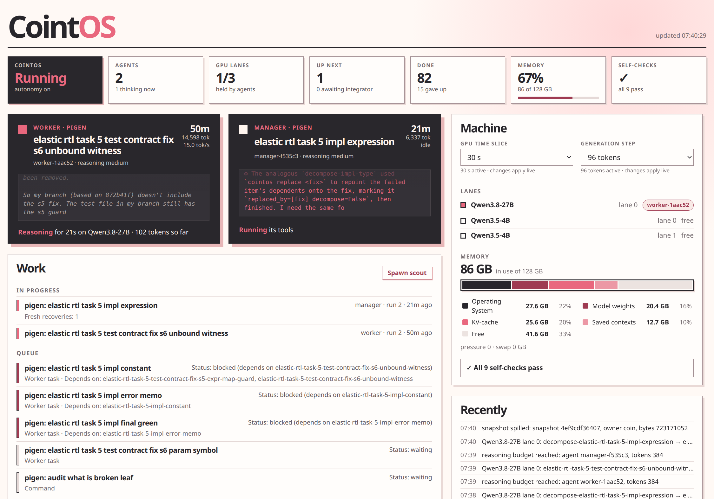

# CointOS

**An operating system for local AI agents.** CointOS runs a small team of autonomous coding
agents on a single workstation, entirely on local models. It treats the GPU the way a kernel
treats a CPU: more agents than the hardware can serve at once take turns on pre-emptible model
lanes, while their conversations, context caches and work survive being paused, swapped out,
or even having the daemon replaced underneath them.



## What it does

- **Schedules GPU time like CPU time.** A thought advances in bounded steps; between steps a
  higher-priority conversation (a chat with you) pre-empts background work, and equal agents
  share lanes by time slice. Saved KV-cache snapshots make switching back cheap.
- **Runs a software pipeline, not a chatbot.** Managers break work into small staged items;
  workers write adversarial test contracts first, then implementations on isolated branches;
  integrators review and land through a gate that re-runs the protected tests on the exact
  candidate. Stewards, test auditors and gardeners keep the projects and their knowledge honest.
- **Owns every lifecycle.** An agent run only ends by submitting one receipt the daemon checks
  against real artifacts. Crashes, budget exhaustion and restarts are recovered deliberately,
  with bounded retries instead of loops.
- **Stays inside a memory budget.** On unified-memory machines, a guard sheds cache, then
  background agents, then the work model before the desktop suffers.
- **Deeply integrated with [knowledgetrees](https://github.com/linkin-parks-bassist/knowledgetrees).**
  Every project, the
  CointOS source and the installed runtime each keep a tree of short, current answers (orientation,
  spec, plan, what is broken). Agents orient from them, managers keep the plan's frontier honest in
  them, integrators update them as work lands, the runtime publishes its live queues into one, and
  gardeners and tree auditors keep them verified.
- **Tells you what is going on.** A live dashboard, a CLI, and a Telegram assistant ("Coin")
  over the same control API. Coin shares one 12-second preparation budget between status
  lookup and its front-model reply, then acknowledges if that budget runs out. Telegram
  delivery time is separate.

## Requirements

CointOS is a personal system built for one machine and is shared as-is. It expects:

- Linux with systemd user services and Python 3.
- [Lemonade](https://github.com/lemonade-sdk/lemonade) / llama.cpp serving GGUF models on
  localhost. The reference setup is a 128 GB unified-memory AMD workstation running
  Qwen3.8-27B for agents and Qwen3.5-4B for chat.
- [OpenCode](https://opencode.ai) as the agent harness.
- [knowledgetrees](https://github.com/linkin-parks-bassist/knowledgetrees) (`kt` and its MCP
  server), which agents use for orientation, specs, plans and runtime state.

Model names, lanes, memory sizes and paths live in `config/cointos.json`.

## Install and replace

This repository is the source; `scripts/install` copies the runtime into `~/.CointOS/`,
renders the systemd user units (`cointosd`, `cointos-coin`) and links `~/.local/bin/cointos`.
Installed `config/projects.json` is user-managed and preserved across upgrades.

- **Full install** (first install, or model/gateway/backend identity changes): `cointos stop`,
  wait until `cointos agents` shows none, run `scripts/install`, then `cointos up`, check with
  `cointos check`, and resume autonomy with `cointos go`.
- **Live install** (code, prompts and daemon-policy config such as reasoning, recovery,
  scheduling and spawning): `scripts/install --live [--wait-seconds N]`. Admitted thoughts
  finish, new requests wait at admission, only cointosd is replaced, and running agent
  units are adopted without relaunch. The drain cancels harmlessly after 60 s by default.
  Incompatible changes are refused before anything is touched.
- **Live settings:** GPU time slice and generation step (`scheduler.slice_seconds`,
  `scheduler.chunk_tokens`) change from the dashboard or `POST /api/scheduler` and apply
  at the next GPU step. Other settings need a live install.
- **Dashboard-only changes:** the daemon reads `web/dashboard.html` on every request, so
  copying that file into `~/.CointOS/web/` is enough.

See `kt how to install cointos` and `kt how to restart cointos`.

## Projects and queues

Enrollment lives in `config/projects.json`, separate from `config/cointos.json`.

```
cointos project new NAME            # create ~/Projects/NAME with Git and a knowledge tree
cointos project add PATH            # register an existing repository
cointos project set NAME --priority N --enable|--disable
cointos project list
cointos queue PROJECT NAME "BRIEF" --kind queued|urgent|command
cointos task PROJECT:ITEM           # exact metadata, dependencies and receipts
```

Lower priority numbers run first within a class. Each project owns its orientation, spec,
plan and broken leaves. The installed runtime publishes a globally readable knowledge tree
describing operation and the daemon-owned queues.
Project changes are saved before they take effect in the daemon; a failed registry write
leaves enrollment unchanged.

Coin (Telegram) exposes the same project operations and can launch a bounded ad-hoc operator
(`run_agent`; CLI `cointos agent run NAME BRIEF [--project P] [--reasoning-effort E]
[--ability standard|control|network]...`). Abilities change real tool permissions; none
grants sudo, package installation, systemd control, Git push or access to private directories.
List those, one per line, in `~/.config/cointos/private-paths`; they are denied to every agent.

## Roles

- **Managers** run one bounded decomposition stage, keep the project plan's remaining frontier
  honest and queue children. They change queued work with `cointos hold` then `cointos revise`.
- **Workers** implement one `skeleton`, `test-contract`, `implementation` or `integration` item
  on an isolated branch and submit an exact commit with a `.work-report.md`.
- **Integrators** review a worker against main and its contracts, maintain the project tree and
  land through the daemon's exact-candidate gate (`cointos land|incorporate|return`).
- **Stewards** periodically roam the runtime and projects for concrete loose ends and may queue
  one manager command; they never implement. Cadence is a six-hour baseline multiplied by one
  plus the active/queued concern count. **Spawn scout** on the dashboard schedules one now.
- **Test auditors** (medium reasoning) sample a recent landing, compare its tests with the spec
  and raise at most one manager command for a real coverage gap.
- **Gardeners** verify a small batch of knowledge leaves per tree; **tree auditors** check one
  structural concern across a sample.
- **Operators** carry one user-requested ad-hoc assignment.

Every run ends with exactly one receipt the daemon checks against its artifacts:
`cointos finish --complete "evidence"` or `--blocked "reason"`; an integrator's verified
land/incorporate/return is its receipt. Process exit, finish markers and final text never
complete a task. `cointos attention` raises an alert that Coin delivers to the owner.

## Tests as contracts

Test-contract workers register adversarial checks and code dependencies in the project's
test-contract manifest. Implementation landings cannot change protected tests or harnesses;
the daemon runs every registered contract covering changed code on the exact candidate before
main moves (for Python, same-file callers of changed helpers are followed). A failed gate
returns the item with details. The verified acceptance receipt is the sole authority that
marks a queue item done.

## Reasoning and budgets

Reasoning effort is `low`, `medium` or `xhigh`, capped per uninterrupted reasoning block at
256 / 384 / 1,024 tokens (`reasoning.budgets`), after which the reply continues into its answer
or tool call. Defaults: low globally; medium for test-contract workers and managers. Effort is
pinned when a task is created; `cointos reasoning PROJECT:TASK EFFORT` changes an existing task
from its next reply, and explicit overrides always win.
Coin also sends the configured default effort on its model requests, so deep tool turns
receive the same reasoning cap.

Each run may spend 1,800 generation seconds or 36,000 generated tokens (reasoning included; lane
wait, prefill and tools excluded). Override with `--generation-seconds`/`--generation-tokens` on
`cointos queue`, or `cointos budget PROJECT:TASK ...` on waiting work; active runs are never
changed underneath. Worker items with no branch artifact by 600 s or 12,000 tokens recover early.

## Recovery

- Ordinary death or daemon restart resumes the same OpenCode session. Gaps under three hours
  resume with `Continue.`; longer gaps get one concise reorientation.
- Budget exhaustion starts up to two fresh sessions that keep the branch and files and receive a
  6,000-character packet of recent outward text, tool actions and Git state. Hidden reasoning is
  never copied.
- A process that exits before its first model request is a launch failure: refunded, retried at
  most twice, then held with an alert.
- `cointos kill AGENT` stops one run and holds its task until `cointos resume TASK`.
- A failed worker item gets one automatic manager pass with its assignment and receipt evidence;
  an unresolved or exhausted manager alerts the owner instead of looping.
- `cointos supersede`, `cointos incorporate` and `cointos clear-review` repair failed
  prerequisites, settle work already on main and withdraw stale infrastructure feedback.

## Memory

The workstation's 128 GB unified RAM is one pool. The memory guard sheds snapshots first, then
background agents, then the work model under sustained pressure. Saved contexts have their own
RAM budget (`memory.snapshots_gb`, 24 GB) and spill to a bounded disk tier; a cache miss only
costs re-reading. `state/events.jsonl` plus one rotated file keep bounded diagnostic events
(8 MiB each) without prompts.

Snapshot admission uses measured sizes from the same model without scaling fixed state
overhead downward for short contexts. Actual save sizes are measured and reconciled.
Caches of terminal tasks are released once no run can resume that conversation, including
workers accepted after their own run ended. Copying finishes before discarded caches are
removed; interrupted copies become cold after daemon replacement.

## Dashboard

`http://127.0.0.1:4200`, pictured above. A status strip (autonomy, agents, GPU lanes, queue, done, memory,
self-checks) sits above two columns: live agent cards and Work (in progress, queue, waiting for
the integrator, then folded **Done** and **Gave up**) on the left; Machine (GPU controls, lanes,
memory breakdown, self-checks), Recently and Projects on the right. **Clear task history**
removes terminal records no unfinished work still references. It retains task evidence and
sessions for transitive prerequisites, recovery work and workers of waiting integrators.

Brief revisions retain omitted construction stage, reasoning effort and budget limits;
explicit budget changes merge the named limits. Correcting wording must preserve the
test-contract/implementation boundary.

## Development

The repository's own knowledge tree (`.knowledge/`) is the design record: start with
`kt where am i`, then `what/is/the/architecture/of/cointos.md`, `what/is/the/spec.md` and
`what/is/the/plan.md`. Run the checks with `python3 -m unittest discover`.
